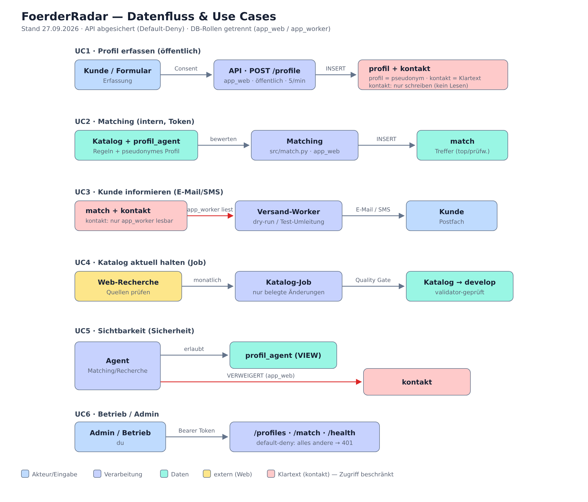
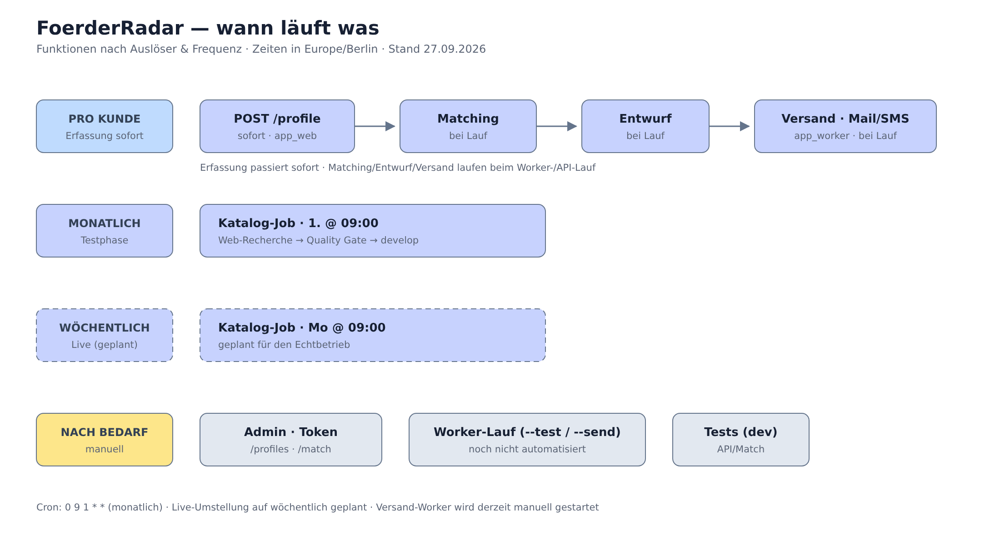
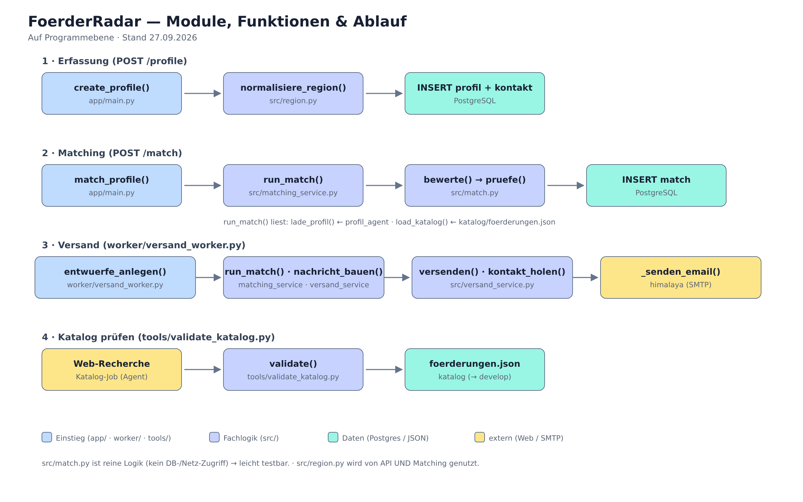
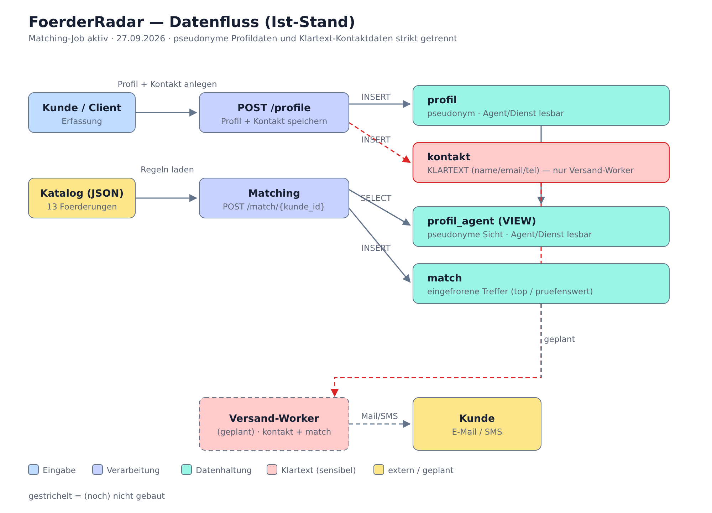

# FoerderRadar — Diagramme

Aktueller Stand: **27.09.2026**

Inhalt:

- **Datenfluss & Use Cases (UC1–UC6)** — `foerderradar-usecases.svg` / `.png`
- **Wann läuft was (Zeitplan)** — `foerderradar-zeitplan.svg` / `.png`
- **Module, Funktionen & Ablauf** — `foerderradar-module.svg` / `.png`
- **Datenfluss (erste Version)** — `foerderradar-datenfluss.svg` / `.png`

Die `.svg`-Dateien sind reiner Text (bearbeitbar, z. B. mit Inkscape); die `.png` sind die
gerenderten Vorschauen.

---

## Datenfluss & Use Cases

## Wann läuft was (Zeitplan)

## Module, Funktionen & Ablauf

## Datenfluss (erste Version)

---

**Legende:** 🟦 Akteur/Eingabe · 🟪 Verarbeitung · 🟩 Daten · 🟨 extern/Web · 🟥 Klartext (`kontakt`, Zugriff beschränkt)
